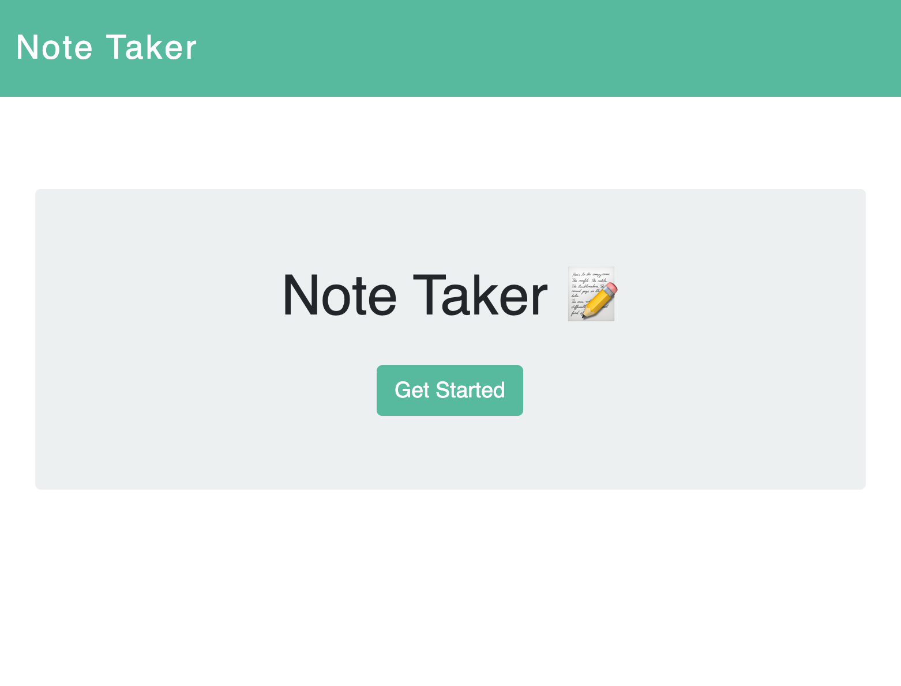
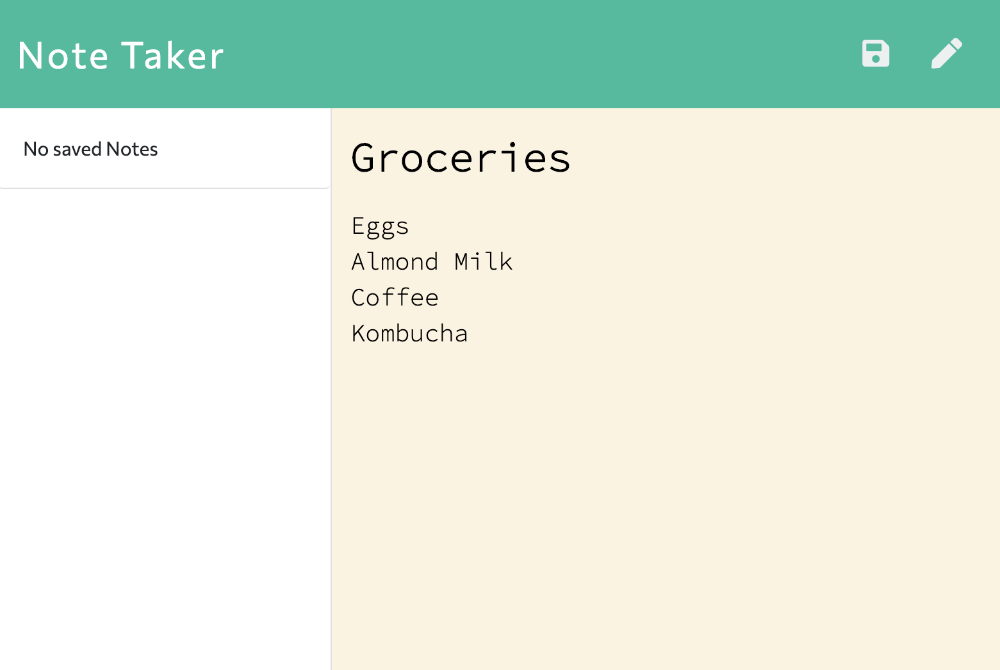
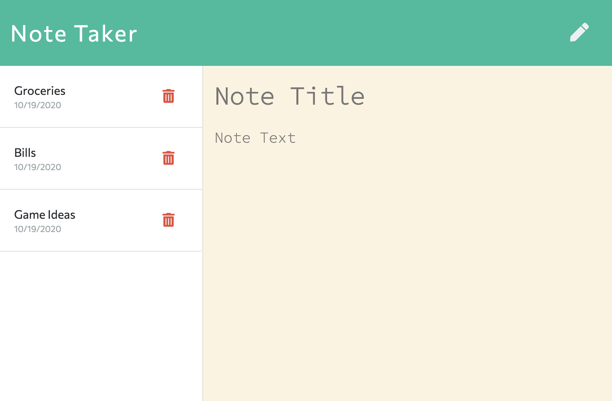
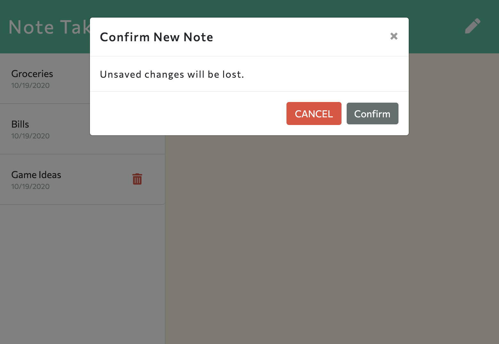

# Note Taker

## Description 

This is a note-taking application that allows a user to write, save, access, and edit notes to and from a JSON file. The front end uses JavaScript and jQuery, and the back end uses Node.js and Express routing. 

When the user opens the application and navigates to the note taking page, all saved notes that exist in the JSON file will be rendered as list items with the creation date. The user can then select any of these old notes, and they will appear in the main text area to be viewed or edited. This allows the user to add, delete, and save new copies of edited old notes. Alternatively, the user can select the pencil icon in order to write a brand new note. When any note is edited or created, the save button will appear, which allows the user to save the new note to the JSON file. The page automatically appends the newly saved notes to the JSON file and the user's list. 

Since this application saves the notes to (and deletes notes from) the JSON.db file, there is no need for a relational or non-relational database to store the data. The application ensures that the JSON file is rewritten upon each addition to or deletion from the file in order to prevent duplicates. POST and DELETE routes ensure that the correct operations happen to the JSON file whether adding or deleting, respectively. 

## Features

* Node.js back end with Express routing. 
* Written in JavaScript and jQuery. 
* ES6 features including array methods and arrow functions. 
* Incorporates Bootstrap for responsiveness. 
* Uses fs to read and write JSON files. 
* Moment.js used for date stamps. 

## Credits

Michael Hanson
* michaeledwardhanson@gmail.com
* [GitHub](https://github.com/mhans003)
* [LinkedIn](https://www.linkedin.com/in/michaeledwardhanson/)

## License 

Licensed under the [MIT License](./LICENSE.txt).